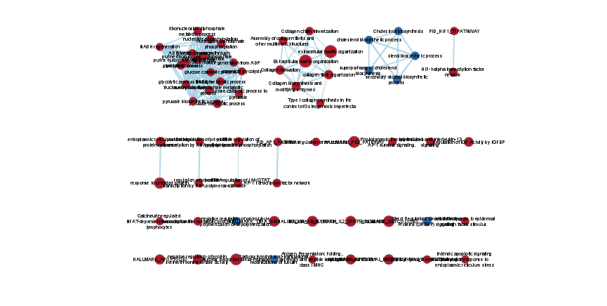
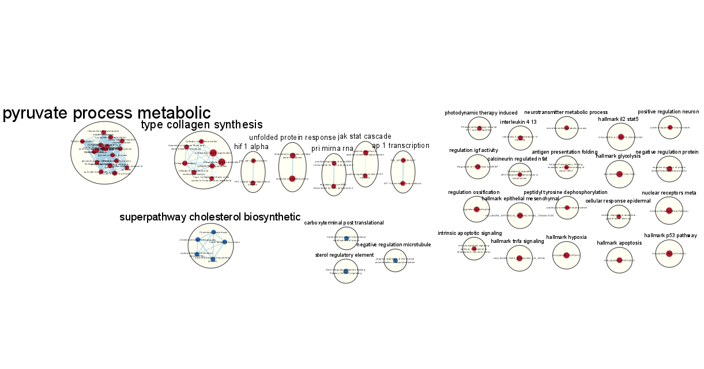
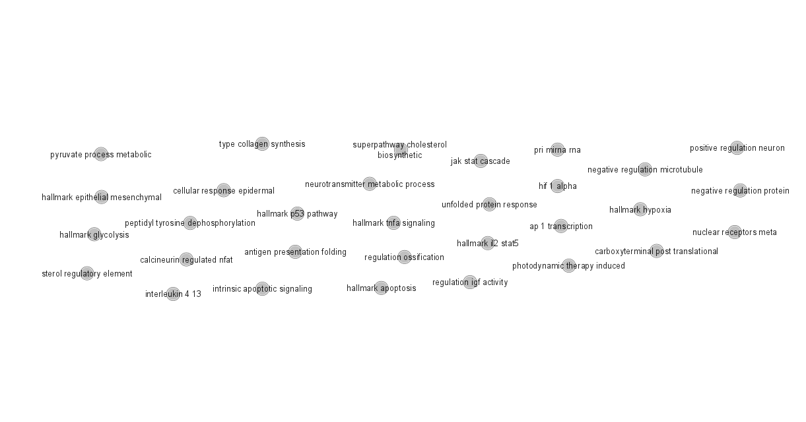
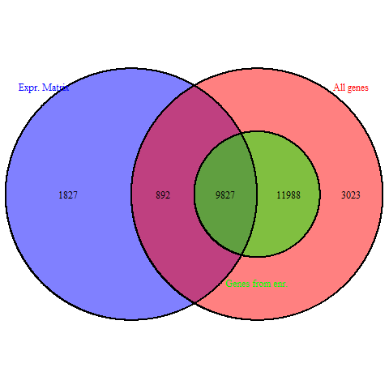

```{r Libraries, message=FALSE, warning=FALSE}
# Libraries
if(!requireNamespace("knitr", quietly = TRUE)){
    install.packages("knitr")
}
if(!requireNamespace("GSA", quietly = TRUE)){
    install.packages("GSA")
}
if(!requireNamespace("VennDiagram", quietly = TRUE)){
    install.packages("VennDiagram")
}
if(!requireNamespace("ComplexHeatmap", quietly = TRUE)){
    install.packages("ComplexHeatmap")
}
if(!requireNamespace("circlize", quietly = TRUE)){
    install.packages("circlize")
}
library(knitr)
library(GSA)
library(VennDiagram)
library(ComplexHeatmap)
library(circlize)
```

## Non-thresholded Gene set Enrichment Analysis

From assignment 2, I've only saved the up and down-regulated genes; to amend this, such that the ranked gene list could be use in the consequent operations. The total ranked genes were saved as following (after -log(pvalue)\*sign):

```{r AmendSaveGenes, eval=FALSE, message=FALSE, warning=FALSE}
ranked_genes <- data.frame(gene=rownames(output_hits), rank=output_hits$rank)
write.table(x=ranked_genes,
            file=file.path("GSE124252_ranked_genes.rnk"), sep="\t", row.names = FALSE,
            col.names = FALSE, quote = FALSE)
```

The gene list preview is as follows:

```{r GeneListPreview}
genes_list <- read.table(file.path("GSE124252_ranked_genes.rnk"), sep="\t")

head(genes_list)

```

### What method, genesets did you use?

GSEA was used in this section; particularly the GUI version (Version 4.2.3) since I've already had experience/practice using the tool.

The gene sets database used was obtained from BaderLab, namely the recent 2022 March release of "Human_GOBP_AllPathways_no_GO_iea_March_01_2021_symbol.gmt".

### Summarize your enrichment results

To view the enrichment results after running GSEA:

```{r GSEAReadEnrichments}
gsea_dir <- file.path("gsea_result")

# Read upregulated gene sets from GSEA result
gsea_enrich_pos <- list.files(gsea_dir, pattern = "gsea_.*(pos).*.tsv")
gsea_enrich_pos <- read.table(paste0(gsea_dir, "/", gsea_enrich_pos), header = TRUE, sep = "\t", quote = '\"')
gsea_enrich_pos <- gsea_enrich_pos[,-c(2, 3, length(gsea_enrich_pos))]

gsea_enrich_neg <- list.files(gsea_dir, pattern = "gsea_.*(neg).*.tsv")
gsea_enrich_neg <- read.table(paste0(gsea_dir, "/", gsea_enrich_neg), header = TRUE, sep = "\t", quote = '\"')
gsea_enrich_neg <- gsea_enrich_neg[,-c(2, 3, length(gsea_enrich_neg))]
```

To display the top gene set for each enrichment results with its associated values:

Top 6 positive/up-regulated genes:

```{r Top6Pos}
kable(head(gsea_enrich_pos), format="simple")
```

Top 6 negative/down-regulated genes:

```{r Top6Neg}
kable(head(gsea_enrich_neg), format="simple")
```

Furthermore the top gene associated with each respective gene sets(ordered by rank metric score): Top 6 genes in the top 1 pos/up-reg. gene set

```{r TopGenePos}
gsea_gene_pos <- read.table(paste0(gsea_dir, "/", head(gsea_enrich_pos[,1], 1), ".tsv"), header = TRUE, sep = "\t", quote = '\"')
gsea_gene_pos <- gsea_gene_pos[,-c(1,length(gsea_gene_pos))] 
head(gsea_gene_pos)
```

Top 6 genes in the top 1 neg/down-reg. gene set

```{r TopGeneNeg, eval=FALSE}
# R cant find this file because it contains a ":" after GSEA generated the files.
# It can only be accessed through a browser/R on Windows.
gsea_gene_neg <- read.table(paste0(gsea_dir, "/", head(gsea_enrich_neg[,1], 1), ".tsv"), header = TRUE, sep = "\t", quote = '\"')
gsea_gene_neg <- gsea_gene_neg[,-c(1,length(gsea_gene_neg))] 
head(gsea_gene_neg)
```

The results were mostly different from the results of the thresholded analysis in A2, the associated gene sets were much more specific in GSEA enrichment results compared to that of A2; this could be due to the gene sets database used to perform the analysis. Furthermore, it is not a straight forward comparison since the two analyses use different techniques to perform their respective analysis.

## Cytoscape visualization

### Create an enrichment map - how many nodes and how many edges in the resulting map? What thresholds were used to create this map?

There are 64 nodes and 194 edges in the resulting maps. The node threshold/cutoff is set for \<0.01 FDR q-value, the edge cutoff is 0.375.



### Annotate your network - what parameters did you use to annotate the network.

An app in Cytoscape called "AutoAnnotate" was used to annotate the network, the parameters are the default upon launching: "Annotate entire network" set set to true, then manually laying out overlapping clusters apart to produce a better image.



### Collapse your network to a theme network. What are the major themes? Do they fit with the model? Are there any novel pathways or themes?



There seem to be a lack of any major themes being presented in this analysis. This could be due to the gene sets database used in GSEA being too specific, further investigation needed.

## Interpretation

### Do the enrichment results support conclusions or mechanism discussed in the original paper? How do these results differ from the results you got from Assignment #2 thresholded methods

The enrichment results obtained neither support nor denies the mechanism discussed in the original paper, however it does relate to the abstraction of the results obtained; for example, the paper describes the epigenetic clock mechanism to be a "property of cells and tissues, rather than the organism as a whole"[@hoshino2019]. Thus, it might be supportive of the mechanism if the enrichment results were produced under a more generic gene set database such that it relates to the author's proposed mechanism.

The results are different from A2, as previously stated that the up/down-regulated gene sets are much more specific in A3 as well as different techniques that GSEA and gProfiler uses to produce the results.

### Can you find evidence/publications, to support some of the results that you see. How does this evidence support your result?

Yes, a recent publication published in February 2022 found that during embryonic development, hematopoiesis lineage is closely related to pyruvate metabolism pathway and is dependent on epigenetic regulation [@oburoglu2021]; this correlates to the biggest cluster seen in the enrichment map. This means the overlapping gene sets in this pathway are relative to other similar epigenetic pathways that deals with specification of cells.

### Dark matters

```{r}
# Using the loaded gsea_enrich_neg and gsea_enrich_pos from above
total_genesets <- c(gsea_enrich_pos$NAME, gsea_enrich_neg$NAME)
genes_used <- c()

genesets_file <- file.path(getwd(),"data", "Human_GOBP_AllPathways_no_GO_iea_March_01_2021_symbol.gmt")
capture.output(geneset<-GSA.read.gmt(genesets_file), file="gsa_load.out")
names(geneset$genesets) <- geneset$geneset.names

for(i in 1:length(total_genesets)){
  curr_gs <- unlist(geneset$genesets[which(geneset$geneset.names %in% total_genesets[i])])
  genes_used <- union(genes_used, curr_gs)
}
all_genes <- unique(unlist(geneset$genesets))

```

In order to construct heatmaps, understanding of which genes are being excluded and the ability to visualize it, is important. Constructing a Venn diagram might help with this process:

```{r echo=FALSE, message=FALSE, warning=FALSE, results="hide"}
exp_matrix <- readRDS("exp_matrix_log2.rds")

A <- all_genes
B <- genes_used
C <- rownames(exp_matrix)
png(file.path(getwd(),"data","dark_matter_visualization.png"))
draw.triple.venn(area1 = length(A), area2 = length(B), area3 = length(C),
                 n12 = length(intersect(A,B)),
                 n13 = length(intersect(A,C)),
                 n23 = length(intersect(B,C)),
                 n123= length(intersect(A,intersect(B,C))),
                 category = c("All genes", "Genes from enr.", "Expr. Matrix"),
                 fill= c("red","green","blue"),
                 cat.col = c("red","green","blue"))
dev.off()
```



Then the significant genes that are not expressed in the pathways are (denoted in the Venn diagram with 892 genes):

```{r}
# Set operation to obtain these genes
gene_exc_enr <- setdiff(intersect(A,C), B)
heatmap_exc_enr_matrix <- t(scale(t(log2(exp_matrix[which(gene_exc_enr %in% rownames(exp_matrix)),]))))
heatmap_exc_enr_col <- colorRamp2(
  c(min(heatmap_exc_enr_matrix), 0, max(heatmap_exc_enr_matrix)), 
  c("blue","white","red"))

heapmap_exc_enr <- Heatmap(as.matrix(heatmap_exc_enr_matrix),
                           show_row_dend = TRUE,
                           show_column_dend = TRUE,
                           col = heatmap_exc_enr_col,
                           show_column_names = TRUE,
                           show_row_names = FALSE,
                           show_heatmap_legend = TRUE)
heapmap_exc_enr
```

Furthermore, for genes that are not annotated in any pathways in the entire set of pathways(denoted in Venn diagram with 1827 genes excluded from set A and B):

```{r}
# Set operation to obtain these genes
gene_exc_all <- setdiff(C, union(A,B))
heatmap_exc_all_matrix <- t(scale(t(log2(exp_matrix[which(gene_exc_all %in% rownames(exp_matrix)),]))))
heatmap_exc_all_col <- colorRamp2(
  c(min(heatmap_exc_all_matrix), 0, max(heatmap_exc_all_matrix)), 
  c("blue","white","red"))

heapmap_exc_all <- Heatmap(as.matrix(heatmap_exc_all_matrix),
                           show_row_dend = TRUE,
                           show_column_dend = TRUE,
                           col = heatmap_exc_enr_col,
                           show_column_names = TRUE,
                           show_row_names = FALSE,
                           show_heatmap_legend = TRUE)
heapmap_exc_all
```

### 

# References
